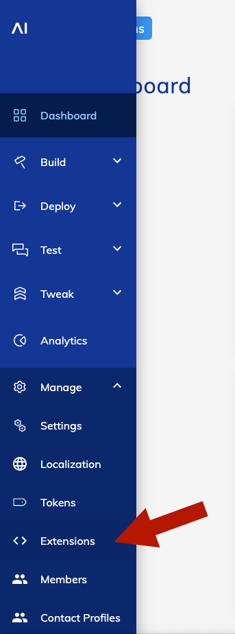
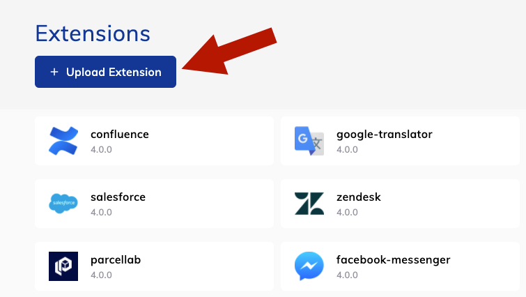
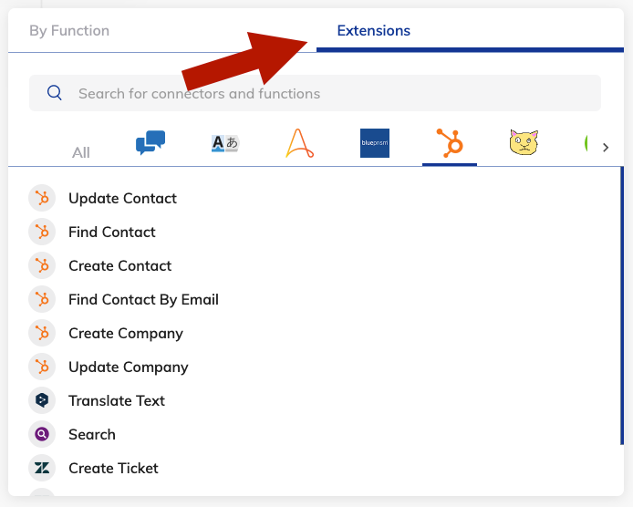

# Installation

In order to install an Extension, we provide two different ways:

- Install from download
- Install from source code

## Download
The easiest way of integrating a already pusblished Extension to your existing Cognigy.AI agent, is to download the released  ready-to-use ZIP file:

1. Download the module you'd like to install from our [Releases](../RELEASES.md) page.
2. [Upload the zipped folder into your Cognigy.AI installation](#upload-an-extension)

## Source Code

The other way is to build the module on your own. All modules in this repository are provided as [TypeScript](https://www.typescriptlang.org/) source code which can be transpiled to JavaScript. In order to use them in your Cognigy.AI installation, you need to perform the following steps:

1. Clone the repository
2. Navigate to a module folder (e.g. extensions/hubspot), run `npm install` to install dependencies and `tsc` to transpile the module from TypeScript to JavaScript
3. If the build process didn't zipped the files already, zip the root of the module and the /build folder
    - `tar extension-name.tar.gz build/* icon.png README.md package.json package-lock.json`
4. [Upload the zipped folder into your Cognigy.AI installation](#upload-an-extension)

# Upload an Extension

1. Login to Cognigy.AI
2. Navigate to `Manage -> Extensions`:

</img>

3. Click on **Upload Extension** and select your zipped folder:

</img>

4. Cognigy will now start uploading your Extension and notifies you as soon as it is uploaded to the agent.
5. Afterward, you are ready to use the exposed Extension nodes in your Flow by clicking on the **+** button and selecing the **Extensions** tab:

</img>

6. Finally, search for the Extension node you want to insert into your Flow.