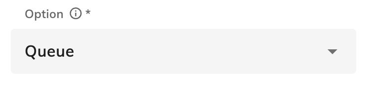
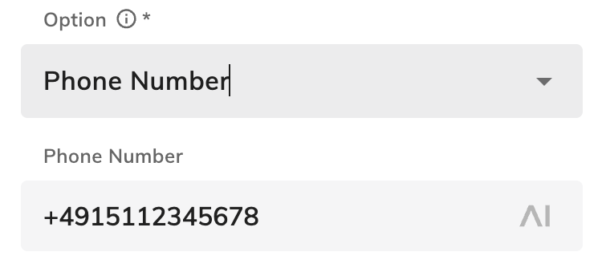

# Amazon Connect

The Amazon Connect Extension exposes the functionality to **han up** or **transfer** a call with Cognigy.AI. In order to make it work in a virtual agent, the "Amazon Connect" Help Center article must be read and followed: https://support.cognigy.com/hc/en-us/articles/360016863379-Amazon-Connect 

## Nodes: Hang Up

This Flow Node hangs up the call by sending the "HANGUP" action to the Connect Contact Flow. After executing this Flow Node, the call will be ended.

## Nodes: Transfer

This Flow Node can forward the current user call to a **queue** or a specified **phone number**. Therefore, it takes **Option** parameter that decides how to transfer:

<u>Queue:</u>

<u>Phone Number:</u>

