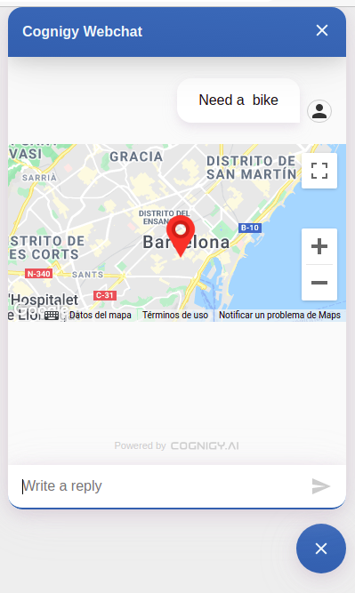

# City Bikes
Integrate Cognigy.AI with City Bikes (https://citybik.es/)

## Connection
You need a Google Maps API KEY 
- key:  api_key, key
- value: Your Google Maps API KEY
  - Geocode API, JavaScript Maps SDK

*IMPORTANT: You need to enable the **Geocoding API** and the **Maps JavaScript API**, while the first one is used to get the latitude and longitude from the search query and the second one to show it with the webchat plugin.*

## Node: Search Station

This node can be used in order to get location and other information about the nearest bike station. You can get it by providing the user address or the user coordinates.

### Address

In order to get the station location, one can ask for the it via plain text. The minimum information required from the user to execute this node is: `place`, `city`, and `country`.

### Coordinates

We can also locate the nearest station by entering the user's coordinates, `longitude` and `latitude`.

This node returns the closest station cityBikes API can provide based on the given data (`station`):

```json 
{
  "station": {
    "userAddress": "Rambla de Catalunya 10, Barcelona, España",
    "userCoordinates": {
      "latitude": "41.3879",
      "longitude": "2.16992"
    },
    "nerarestStation": {
      "empty_slots": 0,
      "extra": {
        "ebikes": 0,
        "has_ebikes": true,
        "normal_bikes": 19,
        "online": true,
        "uid": 65
      },
      "free_bikes": 19,
      "id": "371fdbbe54ad9b4dad4c2348497188ea",
      "latitude": 41.387696,
      "longitude": 2.1696543,
      "name": "PL. CATALUNYA, 10-11 (PG. DE GRACIA)",
      "timestamp": "2021-07-28T12:06:08.429000Z"
    }
  }
}
```

**View**

In combination with the google-maps Webchat Plugin you get this view of the location of the station:

