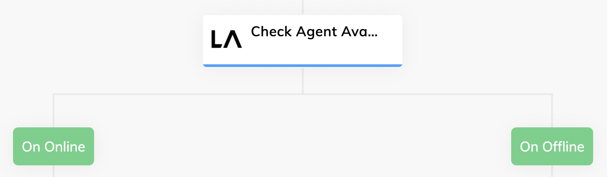

# Cognigy Live Agent

This Extension provides custom helper functions for the Cognigy Live Agent software.

## Connection

- apiKey
  - The access token of the Live Agent profile that can be found in the Profile Settings inside of Live Agent
- baseUrl
  - The base URL of the Live Agent installation, e.g. https://liveagent-trial.cognigy.ai/api/v1
- accountId
  - The ID of the account that is configured in Cognigy.AI for the Live Agent. One can find it in the URL of the Live Agent instance: https://liveagent-trial.cognigy.ai/app/accounts/  **99**  /dashboard

## Node: Check Live Agent Availability

This Flow Node checks if there is at least one agent in the Live Agent instance that has the status "online". If this is the case, the list of available agents will be returned and stored in the Input or Context object. If not, the "On Offline" Child Node will be used as path:

