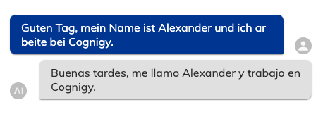

# DeepL

This Extension provides DeepL functions to include in your Cognigy.AI conversation.

**Connection:**
In order to use the nodes below, one needs to sign up for the [Deepl Pro Subscription](https://www.deepl.com/de/pro/). Afterward, the **API KEy** is visible in the user's account section.

- API Key
  - key: key
  - value: DeepL Pro API Key


## Node: Translate Text

This node translates text into a selected language [based on the API](https://www.deepl.com/docs-api/translating-text/example/). It stores the result in the context or input object:

```json
{ 
	"translations": [{
		"detected_source_language":"EN",
		"text":"Der Tisch ist grün. Der Stuhl ist schwarz."
	}]
 }
```

### Example:

The original text is written in **German** and the target language is set to **Spanish**:

