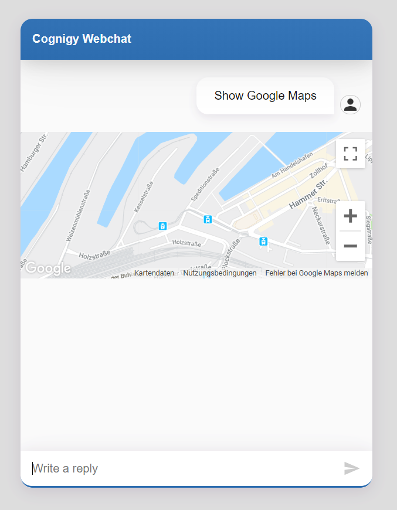

# Google Maps
Integrated Cognigy.AI with Google Maps (https://developers.google.com/maps/documentation/)

**Connection**

- key:  api_key, key
- value: Your Google Maps API KEY
  - Geocode API, JavaScript Maps SDK

## Node: Show Google Maps

**Properties**

There are two ways to use this Extension. Use the [Google Maps Geocoding API](https://developers.google.com/maps/documentation/geocoding/start) to get the longitude and latitude of the address. 

*IMPORTANT: You need to enable the **Geocoding API** and the **Maps JavaScript API**, while the first one is used to get the latitude and longitude from the search query and the second one to show it with the webchat plugin.*

If the Searchquery field is empty or no Place was found, the module use the default values from Latitude and Longitude. 

**View**

In combination with the google-maps Webchat Plugin you get this view:


## Node: Search Location

This node can be used in order to get location information about the current user.

## Address

In order to get the user location, one can ask for the it via plain text. The minimum information required from the user to execute this node is: `place`, `city`, and `country`. 

This node returns the closest location google maps can provide based on the given data (`place`):

```json 
{
  "place": {
    "coordinates": {
      "latitude": 51.2139586,
      "longitude": 6.7489951
    },
    "address": "Speditionstraße 1, 40221 Düsseldorf, Germany",
    "name": "Cognigy"
  }
}
```

## Coordinates

Since it could be the case that one only retrieves the **longitude** and **latitude** information, the reserve way can be used. In this case, this node returns the **formatted address** based on the geocodes:

```json
{
  "maps": {
    "address": "Speditionstraße 1, 40221 Düsseldorf"
}
```
