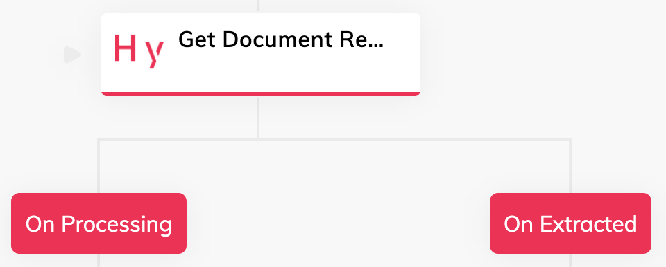

# Hypatos

This Extension can be used in order to extract information from a given document. This document can be uploaded by the user by, for example, taking a photo of it and sending it to the Cognigy.AI virtual agent. In every case, the virtual agent will use the reference URL of the given document and not the document itself since all channels provide this URL after uploading a document (e.g. WhatsApp, Facebook, MS Teams, etc.).

## Connection

- [Vendor Documentation](https://hypatos.github.io/studio-api-docs/#section/Authentication)

The `application_id` and `application_key` must be provided as basic authentication credentials, `username` and `password` respectively.

## Nodes: Upload Document

This Flow Node uploads a document to the Hypatos.ai based on a provided `File URL` that references the document. This could be similar to https://example.com/document.png. Furthermore, the Hypatos.ai project has to be selected from the list of given projects. As soon as the required Connection is created and valid, the `Project ID` select field will show the projects of the given account.

The result of this Node is the ID of the successfully uploaded document which is whether stored in the Input or Context of the current conversation:

```json
{
    "hypatos": {
        "documentId": "..."
    }
}
```

## Nodes: Get Document Results

As soon as the user's document is uploaded, the virtual agent can check the extracted results -- of course this is possible with existing documents as well. In order to do so, the same `Project ID` as above must be selected while, in addition, the `Document ID` required.

Based on the current status of the document, the "On Processing" or "On Extracted" Child Node will be set as next Node:



The extracted results will be stored in the Input or Context of the current conversation and look similar to:

- [Vendor Documentation](https://hypatos.github.io/studio-api-docs/#operation/getDocumentById)

```json
{
  "hypatos": {
    "id": "...",
    "projectId": "...",
    "fileName": "cognigy-9964f357-d1ae-490f-88a2-ac21eed8da57",
    "state": "extracted",
    "updatedAt": "2022-04-20 16:17:30.468000",
    "uploadedAt": "2022-04-20 16:17:25.973000",
    "completedAt": null,
    "completedBy": null,
    "entities": {
      "type": null,
      "number": null,
      "issuedAt": null,
      "deliveredAt": null,
      "currency": {
        "value": "EUR",
        "rawValue": "EUR",
        "indices": null,
        "region": null,
        "probability": 0.7744140625,
        "originalProbability": 0.7744140625,
        "labelledAt": "2022-04-20T16:17:30.224000",
        "labelledBy": null,
        "valueModifiedAt": null,
        "valueModifiedBy": null,
        "originalValue": "EUR",
        "legacyId": "..."
      },
      "recipientPoNumber": null,
      "items": [
        {
          "itemNumber": null,
          "name": {
            "value": "Product A",
            "rawValue": "Product A",
            "indices": null,
            "region": null,
            "probability": 0,
            "originalProbability": 0,
            "labelledAt": "2022-04-20T16:17:30.224000",
            "labelledBy": null,
            "valueModifiedAt": null,
            "valueModifiedBy": null,
            "originalValue": "Product A",
            "legacyId": "..."
          },
          "qty": {
            "value": 15,
            "rawValue": "15.0",
            "indices": null,
            "region": null,
            "probability": 0.9677734375,
            "originalProbability": 0.9677734375,
            "labelledAt": "2022-04-20T16:17:30.224000",
            "labelledBy": null,
            "valueModifiedAt": null,
            "valueModifiedBy": null,
            "originalValue": "15.0",
            "legacyId": "..."
          }
        },
        "...": "..."
        ]
      },
      "others": {
        "taxExemption": null,
        "serviceTime": null
      }
    },
    "validationResult": {
      "failures": 0,
      "properties": {}
    },
    "externalData": null,
    "origin": [
      {
        "type": "publicApi"
      }
    ]
  }
}
```