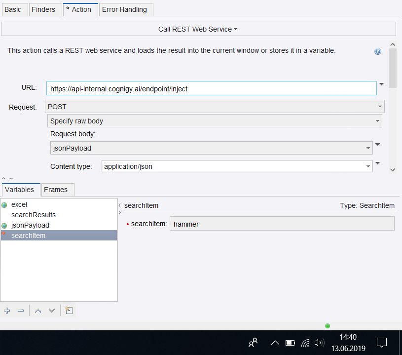
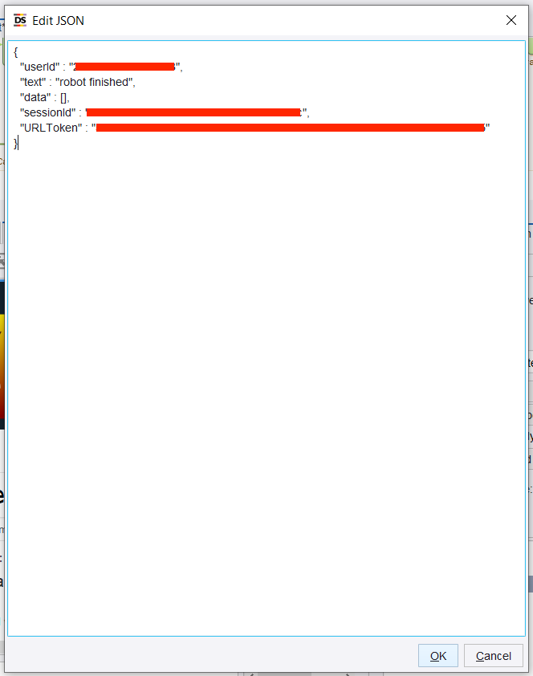

# Kofax Custom Module

This Custom Module integrates the [Kofax RPA](https://www.kofax.de/-/media/Files/Datasheets/DE/ps_kofax-kapow_de.pdf) with Cognigy.AI

**Connection (RPA):**
- key: api_key
- value: The Cognigy Request Forwarder API Key

You need this secret to use the request forwarder. This forwarder starts the Kofax Robot and directly sends a `200 Accepted` if nothing gone wrong. So the user can continue chatting with the bot.

## Node: RunRobot

This Node runs a specific Kofax Robot, which was created in the [Kofax Design Studio](https://www.coforce.nl/kofax-kapow/design-studio/?lang=en). To test Kofax you can get your Trial [here](https://www.kofax.com/Products/Robotic-Process-Automation/Kapow/rpa-free-trial?crmCampaignID=CMP-14638-T2C7F5). \
To start a robot you have to define one. If you don't know how yet, please follow this [Getting Started Video Collection](https://www.kofax.com/Learn/Videos/kofax-rpa-tutorials?utm_campaign=10758&utm_medium=email&utm_source=Eloqua). 

After this, you can upload your built robot to the **Management Console** and get the example **REST API Request** from the `Repository/Robots` section, where you have to click on the **REST** button on the right side of your uploaded robot. You need the **JSON** body for this custom module node: 

``` json
{
    "urlToForward": "ROBOT REST POST URL",
    "bodyToFoward": {
      "THE JSON FORMAT BODY"
    }
  }
```
The `urltoForward` key needs your robot's REST POST REQUEST url, which you can find in the **REST** example in the Management Console. Then you need the **JSON** format body of this example. This will include your variables etc. An example could look like this: 
``` json
{
    "urlToForward": "http://ip:50080/rest/run/Defaultproject/SearchHardware.robot",
    "bodyToFoward": {
      "parameters": [
        {
          "variableName": "searchItem",
          "attribute": [
            {
              "type": "text",
              "name": "searchItem",
              "value": "hammer"
            }
          ]
        }
      ]
    }
  }
```

### Calling the Cognigy Injection API
After calling starting the robot with the **RunRobot** node, it won't call Cognigy again or send the stored data to your chat conversation. For this functionality you need the [Inject API](https://docs.cognigy.com/v3.3/reference#post_inject) from Cognigy. There you can send the stored data as a data object. An example request in **Design Studio** could look like the following: 



The variable `jsonPayload` will later contain the entire robot output in the **data** key:



For what do you need the keys?
- **userId**: 
    - The robot has to know which user is chatting
- **text**:
    - With this text the robot will inject a message to the flow
    - In this example the intent needs the input text "robot finished" to let the user know that the robot finished his task.
- **sessionId**:
    - Every chat conversation in Cognigy has its own session id, so the robot will know in which conversation he has to inject the message.
- **URLToken**: 
    - Last but not least the Injection API has to know via which endpoint the chat is available now. After the **Endpoint URL** you only have to copy the ID like `81a96c7f83c4d00bb0e604037e894...`.

With this configuration in your Design Studio robot, the robot will inject the live conversation.