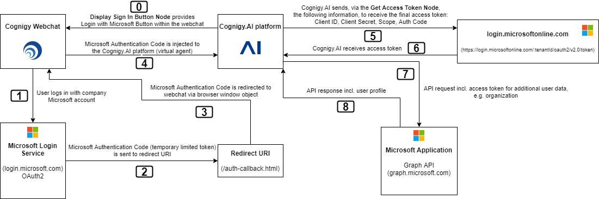

# Login to Microsoft

In order to use Microsoft applications, such as the Microsoft Graph API, the user needs to authenticate theirself in the webchat. For a better user experience, the common **Sign in with Microsoft** button is displayed:


Before this button can be used, a Microsoft Azure Application needs to be configured. Please follow the steps of [this tutorial](../login/README.md) in order to provide the authentication on the server side.

## Authentication Architecture

Finally, the architecture of the Microsoft login process looks like the following:




## Connection

Both authentication nodes, **Display Sign In Button** and **Get Access Token** need to use the following Cognigy Connection in order to access the Microsoft Azure App Registration:

- clientId
    - key: clientId
    - value: The Azure App Regestrations client ID

Login to portal.azure.com and create a new **App regestration**. After this, you will see your client ID.

- clientSecret
    - key: clientSecret
    - value: The Client Secret of your App regestration

You need to click on **Certificates & Secrets** in the left side menu and create a new Client secret.

## Node: Display Sign In Button

This node starts the Webchat plugin in order to open the **Sign in with Microsoft** button in the webchat.

- [Microsoft Auth Webchat Plugin](../login/webchat-plugin/README.md)

## Node: Get Access Token

This node returns the final `access_token`: 
```json
{
    "key": "value",
    "microsoft.auth": {
        "token_type": "Bearer",
        "scope": "User.Read profile openid email",
        "expires_in": 3600,
        "ext_expires_in": 3600,
        "access_token": "eyJ0eXA...-2dg"
    }
}
```

---

**Next Steps:**

- [Use the Graph API](./graph-api.md)