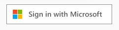

# Microsoft Auth Webchat Plugin

This plugin is used in order to display the **Sign in with Microsoft** button inside the Cognigy Webchat:



## Extension: Microsoft

This webchat plugin is used by the [Microsoft](../../README.md) Extension and executed by the **Start Authentication Node**. There, the **Data** payload looks such as the following:

```json
{
  "_plugin": {
		"type": "microsoft-auth",
		"clientId": "...",
		"redirectUri": "https://some-url.com/auth-callback",
		"scope": "user.read",
		"tenant": "..."
  }	
}
```