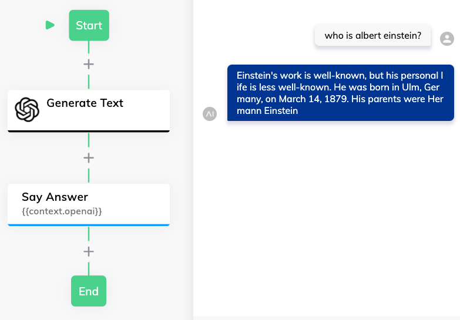

# OpenAI

Integrates Cognigy.AI with the OpenAI project (https://openai.com/)

## Connection

- apiKey
  - The OpenAI API Key that one can find here: https://beta.openai.com/account/api-keys

## Node: Generate Text

Summarizes a longer given text based on various parameters:

- [max length](https://beta.openai.com/docs/api-reference/completions/create#completions/create-max_tokens)
- [temperature](https://beta.openai.com/docs/api-reference/completions/create#completions/create-temperature)
- [top_p](https://beta.openai.com/docs/api-reference/completions/create#completions/create-top_p)
- [stop](https://beta.openai.com/docs/api-reference/completions/create#completions/create-stop)
- [presence_penalty](https://beta.openai.com/docs/api-reference/completions/create#completions/create-presence_penalty)
- [frequency_penalty](https://beta.openai.com/docs/api-reference/completions/create#completions/create-frequency_penalty)

Read the following documentation for more information: https://beta.openai.com/docs/api-reference/completions/create 

**Example**

For example, with the default context about Albert Einstein (copied from [Wikipedia](https://en.wikipedia.org/wiki/Albert_Einstein)), the following conversation would be possible based on the automatic answer that OpenAI provides:

