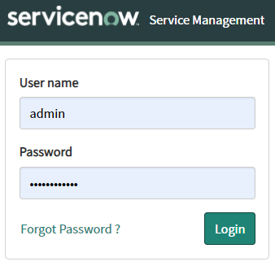
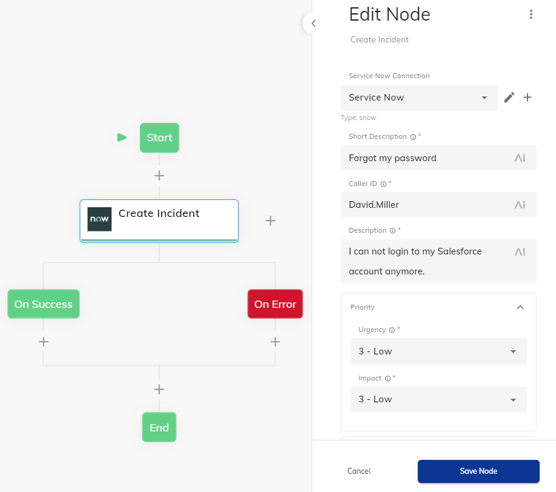
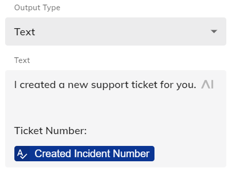
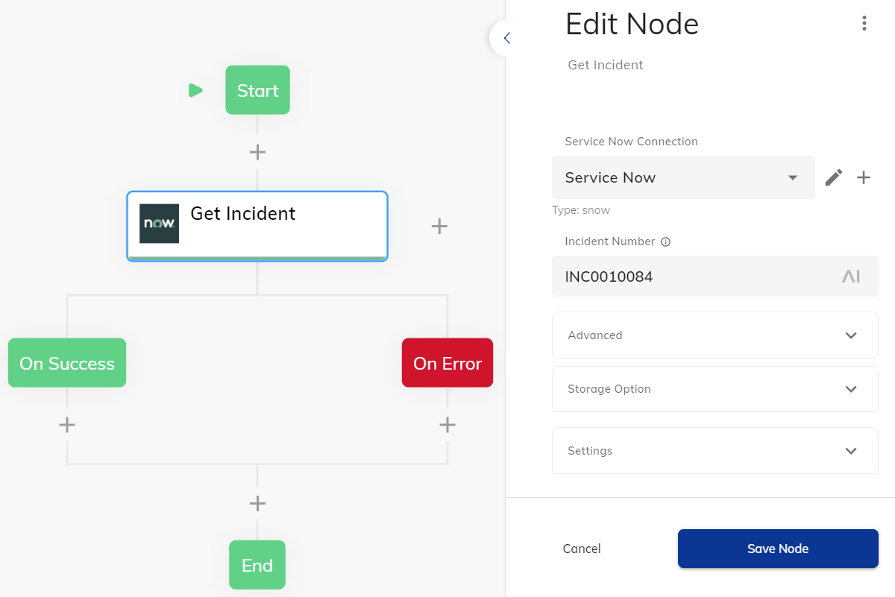
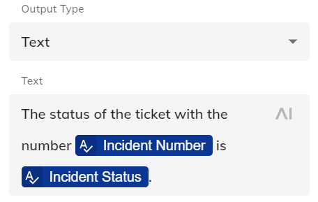
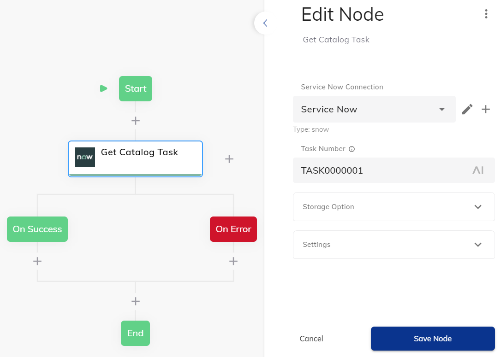
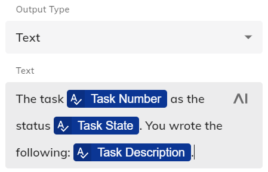
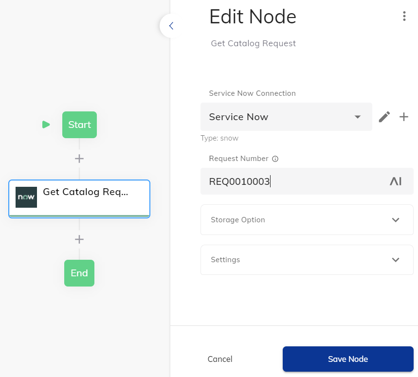

# Service Now Extension

Integrates the Service Now Software with Cognigy.AI.

## Connection

Before the Extension can be used in order to work with *Incidents* or the *Service Catalog*, for example, a so-called Connection needs to be created in Cognigy.AI. The following values can be found in the Service Now login screen:

  - **username**
    - The username of the Service Now account that should be used in Cognigy.AI.
  - **password**
    - The password of this Service Now user.
  - **instance**
    - This is the URL of the Service Now installation, the organization uses. For example, https://dev12345.service-now.com or https://mycompany.service-now.com



## Incidents

With the help of this Extension, the Cognigy.AI virtual agent is able to **create** and **retrieve** incidents from Service Now.

### Node: Create Incident

One common use-case for Service Now is to crete a new incident in the [Incidents Table](https://www.servicenow.com/products/incident-management.html):



From default, the result will be stored in the [Input Object](https://docs.cognigy.com/docs/input). It consists of the detailed information about the successfully created incident:

```json
{
  "snow": {
    "createdIncident": {
      "sys_updated_on": "2021-04-16 09:22:30",
      "number": "INC0010086",
      "state": "1",
      "impact": "3",
      "priority": "5",
      "short_description": "Forgot my password",

      "description": "I can not login to my Salesforce account anymore. ",
      "category": "inquiry"
    },
    "...": "..."
  }
}
```

This information can be used dynamically in the further Flow, such as in a confirmation Say Node:



### Node: Get Incident

If the virtual agent should provide the same detailed information about an older incident, the **Get Incident** Node could be used. It takes the **Incident Number** and stores the result in Cognigy.AI:



In this case, the result looks similar to the one mentioned above:

```json
{
  "snow": {
    "createdIncident": {
      "sys_updated_on": "2020-12-24 11:00:20",
      "number": "INC0010084",
      "state": "1",
      "impact": "1",
      "priority": "5",
      "short_description": "Computer Monitor is broken",

      "description": "I am not able to use the monitor of my computer anymore. It keeps showing screen",
      "category": "hardware"
    },
    "...": "..."
  }
}
```

This information can be used dynamically in the further Flow, such as in a confirmation Say Node:



## Service Catalog

"With the ServiceNow® Service Catalog application, create service catalogs that provide your customers with self-service opportunities. Customize portals where your customers can request catalog items such as service and product offerings. You can also standardize request fulfillment to ensure the accuracy and availability of the items in the catalogs. ([Service Now](https://docs.servicenow.com/bundle/newyork-it-service-management/page/product/service-catalog-management/concept/c_ServiceCatalogManagement.html), 2021)". In order to provide this feature in Cognigy.AI as well, the following Flow Nodes can be used.

### Node: Get Catalog Task

If the user wants to get an update about a previously created **Task**, the **Get Catalog Task** Node can be used:



This information can be used dynamically in the further Flow, such as in a confirmation Say Node:




### Node: Get Catalog Request

Next to the Task, one could ask for **Request**, which can be retrieved from Service Now by using the **Get Catalog Request** Node.



This information can be used dynamically in the further Flow, such as in a confirmation Say Node:


## Email

With the Email serivce, one can maintain email messages within Service Now.

### Node: Send Email

- [Documentation](https://docs.servicenow.com/bundle/rome-application-development/page/integrate/inbound-rest/concept/email-api.html)

This Flow Node can be used in order to send an email message with the Service Now SMTP/Pop configuration. It will return the following JSON if the message was sent successfully:

```json
{
  "snow": {
    "email": {
      "id": "...",
      "links": [
        {
          "rel": "self",
          "href": "/now/v1/email/..."
        },
        {
          "rel": "status",
          "href": "/now/v1/email/...?sysparm_fields=id,type,state,error"
        }
      ]
    }
  }
}
```