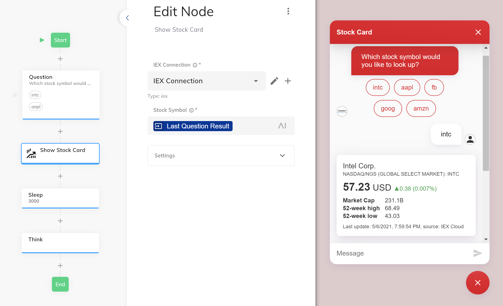

# Stock Quote Adaptive Card

This [Cognigy Webchat](https://github.com/Cognigy/WebchatWidget) [Extension](https://github.com/Cognigy/Extensions) requests stock quote and other numbers from [IEX Quote API](https://iexcloud.io/docs/api/#quote). Then it sends an adaptive card to the web chat, which renders it using the [Adaptive Cards webchat plugin](https://github.com/Cognigy/WebchatPlugins/tree/master/plugins/adaptivecards).

## Prerequisites

This extension will not work if the [Adaptive Cards webchat plugin](https://github.com/Cognigy/WebchatPlugins/tree/master/plugins/adaptivecards) is not installed! This [help center article](https://support.cognigy.com/hc/en-us/articles/360019611899-Webchat-Plugins-Installation#install-in-cognigy-ai-0-0) explains how to do it.

## Nodes

The extension contains one node: `Show Stock Card`. It has the following properties:

- `IEX Connection` - a connection with a `token`, which is required to get authorozed by IEX API. You can get a fee token after you register and log in [IEX Cloud Console](https://iexcloud.io/console/tokens). There are two API tokens in the console: secret and publishable. You need your publushable token.
- `Stock Symbol` - a symbol or ticker that identifies the stock, e.g. `AAPL` for Apple Inc. Must be one of the symbols [supported by IEX Cloud](https://iextrading.com/trading/eligible-symbols/).

## Example setup

