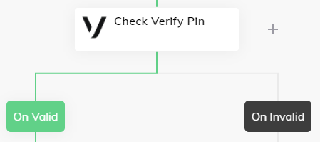

# Vonage

This Extension provides [Vonage][https://vonage.com] functions.

## Connection

In order to use the nodes below, one needs to sign up for the [Vonage API Account](https://dashboard.nexmo.com/). Afterward, the **API Key** and **API Secret** are visible in the user's account section.


## Node: Send SMS

This nodes sends an SMS message **to** a specified number, with a given **text**.

## Node: Send Verify Pin

In order to authenticate a user, a **verification pin** can be sent via SMS. In this case, a **brand name** and **receiver number** is required such as:

- Brand Name: Cognigy
- Receiver Number: 4912345678910

In the advanced section, the **pin expiration time** and **code length** can be configured as well. The result will be stored in the Input or Context object, while the `request_id` is required for further verification steps:

```json
{
    "vonage": {
        "pin": {
            "request_id": "..."
        }
    }
}
```

## Node: Check Verifiy Pin

After sending the verification pin with the Flow Node above, this code can be checked directly. In this case, a [Question Node](https://docs.cognigy.com/docs/question) could be used in order to ask the user for the received value. Last but not least, the Flow will follow the *On Valid* or *On Invalid* path -- based on the validation:

